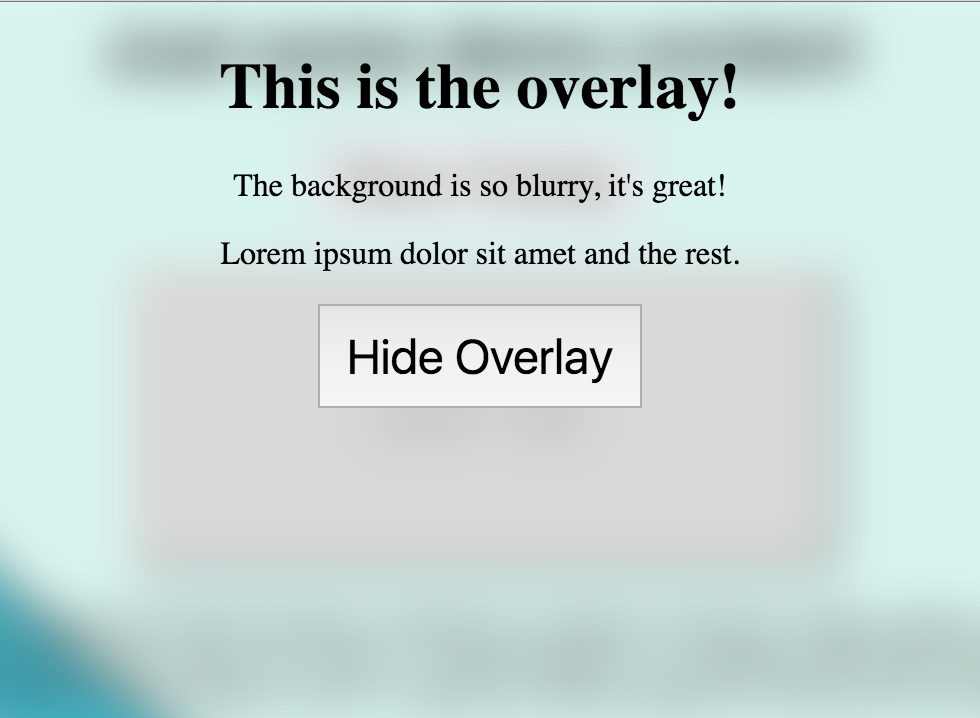

# blur-overlay



jQuery plugin for creating blurry overlays. Can customize the content, blur amount, and transition types.

Requires jQuery (developed with 2.2.4) and jQuery UI (developed with 1.12.0).

## Installation

For now, just grab the latest `dist/index.js`.

## Usage

```js
$(document).on('ready', function () {
  // Grab the element you want to "wrap" with blur
  var $target = $('#something');

  // Grab the content you want to display in the overlay
  var $overlay = $('#overlay').detach().show();

  // Initialize the overlay
  $target.blurOverlay({
    // Overlay content
    content: $overlay,
    // Blur amount (default 12px)
    blurAmount: '10px',
    // Duration of CSS transitions
    transitionDuration: '500ms',
    // Type of CSS transitions
    transitionType: 'cubic-bezier(.22,.57,.27,.92)'
  });

  // Show the overlay
  $target.blurOverlay('show').then(function () {
    console.log('overlay is showing');
  });

  // Hide the overlay
  $target.blurOverlay('hide').then(function () {
    console.log('overlay is hidden');
  });

  // Update the content of the overlay
  $target.blurOverlay('content', '<p>New Content</p>');

  // Determine if the overlay is showing (true or false)
  console.log('Overlay is showing: ' + $target.blurOverlay('isShowing'));

  // Listen for events on the overlay
  $target.on('blurOverlay.beforeShow', function () {
    console.log('beforeShow event');
  });
  $target.on('blurOverlay.show', function () {
    console.log('show event');
  });
  $target.on('blurOverlay.beforeHide', function () {
    console.log('beforeHide event');
  });
  $target.on('blurOverlay.hide', function () {
    console.log('hide event');
  });
});
```

## Developing

First and foremost, fork/clone the repo and run:
```bash
cd blur-overlay
# Use the recommended node version
nvm use
# Install dependencies
npm install
```

If you don't have `nvm`, get it here: https://github.com/creationix/nvm

### npm scripts

Use the npm scripts defined in `package.json` to perform common build tasks:

| Command | Description |
| --- | --- |
| `npm test` | Run unit tests using Karma and PhantomJS (single-run only) |
| `npm run test-serve` | Start the Karma server (can debug at http://localhost:9876) |
| `npm run lint` | Lint `src/` and `spec/` with ESLint (with `--fix` flag) |
| `npm run build` | Transpile `src/` using Babel, sending output to `dist/` |

## License

MIT. See [LICENSE](LICENSE).
